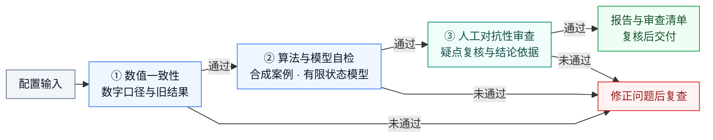

# verification-gate-review

[](LICENSE)

配置驱动的验证门禁工具：核对数字口径、检查算法合成案例，并可选地验证有限状态模型，输出可复现的检查报告与疑点清单。

适合数值建模、论文结果交付和小型工作流验证。项目保留三层流程：

| 层级 | 实现 | 检查内容 |
|---|---|---|
| 数值一致性 | `scripts/check_consistency.py` | 权威数字出现情况、废弃数字/文本残留、孤儿数字候选 |
| 算法与模型自检 | `scripts/synthetic_check.py` | 已知答案还原误差；可选有限模型的不变量、死锁与最短反例 |
| 对抗性审查 | 人工或 AI 辅助整理 | 质疑核心结论，记录事实、答辩依据与待补事项 |

## 工作流程



第二层按配置执行合成案例和/或有限状态模型检查；检查未完成或疑点未解决时不能交付。两个脚本独立生成报告，第三层及整体交付判断由人工完成。

## 快速开始

从仓库根目录运行以下命令。依赖为 NumPy 和 SciPy；当前已在 Windows / Python 3.13 环境验证。

```bash
git clone https://github.com/yuye05/verification-gate-review.git
cd verification-gate-review
python -m pip install -r requirements.txt
```

仓库提供可直接运行的付款—发货流程示例：

```bash
python -X utf8 scripts/check_consistency.py --config examples/microservice_order/gate_config.json
python -X utf8 scripts/synthetic_check.py --config examples/microservice_order/gate_config.json
```

预期：两个脚本通过；正确模型声明 4 个状态组合，穷尽 3 个可达状态。
报告生成到 `examples/microservice_order/reports/pass/`。

再运行故意缺少付款守卫的负对照：

```bash
python -X utf8 scripts/synthetic_check.py --config examples/microservice_order/gate_config_buggy.json
```

预期：**FAIL，退出码 1**，关联需求 `REQ-ORDER-001`，反例为“初始状态 → 未付款直接发货”。
这是预期的缺陷检测结果；报告生成到示例的 `reports/negative_control/`。
第三层记录见[对抗性审查清单](examples/microservice_order/docs/对抗性审查清单.md)。

## 在自己的项目中使用

1. 参考[配置说明](references/configuration.md)和[配置模板](references/gate_config.example.json)，创建项目的 `gate_config.json`。
2. 指定权威数字来源、扫描文件和需执行的算法/模型检查。模板中的光学路径及旧数字是示例，使用前须替换。
3. 运行两个脚本，处理 FAIL 项，并复核 WARN 和孤儿候选。
4. 针对核心结论填写 `对抗性审查清单.md`，注明检查范围后再交付。

```bash
python -X utf8 scripts/check_consistency.py --config /path/to/gate_config.json
python -X utf8 scripts/synthetic_check.py --config /path/to/gate_config.json
```

配置中的相对路径以**配置文件所在目录**为基准。两个脚本均支持 `--outdir` 覆盖报告目录。
第二层至少配置一项光学检查、`generic_check` 或 `model_check`；未配置的检查不会被当作已执行。

## 判定与产物

| 检查 | 判定规则 |
|---|---|
| 一致性 | 旧数字或旧文本命中即 FAIL；核心数字缺失为 WARN；孤儿数字列为复核候选 |
| 算法自检 | 误差须严格小于阈值；空案例、非有限结果、形状不符和算法异常不能通过 |
| 模型检查 | 不变量违例或非终止死锁为 FAIL；达到状态上限为 INCONCLUSIVE，阻止通过 |
| 对抗性审查 | 人工确认质疑点已有依据和答辩，明确记录未解决事项 |

| 退出码 | 含义 |
|---|---|
| `0` | 该脚本通过；一致性结果仍可能包含 WARN/候选 |
| `1` | 检查失败，或模型检查尚未穷尽 |
| `2` | 配置或输入错误 |

输出包括 `门禁报告_一致性.md`、`门禁报告_合成自检.json` 和人工整理的 `对抗性审查清单.md`。
JSON 报告包含所运行检查、误差或模型反例，以及配置/模型 SHA-256。
运行报告含时间戳与本机路径，作为本地证据使用，不随源码提交。

整套门禁通过要求：一致性无 FAIL、第二层所配检查全部通过、WARN/候选已复核、对抗清单已有答辩依据。
两个脚本独立运行，不自动汇总第三层；执行出错时不能用旧报告替代本次证据。

## 能力边界

- 数字检查按数值和容差匹配，不理解句子语义，不自动换算物理单位或百分比；孤儿候选仍采用启发式。
- 合成测试只覆盖所选输入，不能据此证明算法在全部输入上正确。
- 模型检查穷尽的是声明的有限模型，不验证实际服务代码、分布式消息行为、活性或公平性。
- `generic_check` 会导入执行本地 Python 模块，只使用来源可信、已经审查的代码。
- 本工具不替代论文结构审查、代码审查或真实系统测试。

## 验证与开发

```bash
python -X utf8 evals/check_regressions.py
python -X utf8 scripts/synthetic_check.py --config references/gate_config.example.json --outdir ../evals/optical_smoke
```

当前回归入口包含 45 项检查，覆盖正常结果、缺陷负例、配置错误、数值边界和模型状态上限。
光学示例包含 9 个还原案例和 kurtosis 判据。实际判定以本次命令输出为准。
贡献流程见 [CONTRIBUTING.md](CONTRIBUTING.md)，待发布变更见 [CHANGELOG.md](CHANGELOG.md)。

## 作为 Skill 使用

本仓库提供 [SKILL.md](SKILL.md)。放入使用环境支持的 Skill 目录后，明确要求“跑门禁”或“用 verification-gate”调用。
Claude Code 可使用 `~/.claude/skills/verification-gate-review/`；其他环境按其 Skill 安装约定处理。
该 Skill **仅手动触发**，不因普通“检查/审查”措辞自动执行。

## 仓库结构

```text
verification-gate-review/
├── README.md / SKILL.md
├── LICENSE / AUTHORSHIP.md
├── CONTRIBUTING.md / CHANGELOG.md
├── requirements.txt
├── scripts/                  # 一致性、合成自检、有限模型检查
├── references/               # 配置说明、模板、设计与后续方向
├── examples/microservice_order/
│   ├── *.json                # 配置、正确模型、缺陷模型与预期值
│   └── docs/                 # 结果说明与对抗清单
└── evals/                    # 回归入口与 Skill 使用评估案例
```

实现选择和后续方向见[设计说明](references/design-notes.md)。

## 许可证与作者

项目采用 [MIT License](LICENSE)。作者为 [Jimmy王（yuye05）](https://github.com/yuye05)，贡献与辅助工具使用记录见 [AUTHORSHIP.md](AUTHORSHIP.md)。
