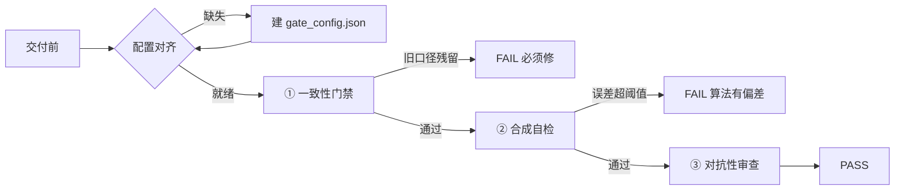

# verification-gate-review

交付数字结果 / 算法结论 / 文档口径前，用机器可复现的 PASS/FAIL 报告替代口头承诺"没问题了"。

一个配置驱动的**数据交付验证门禁**：报告说 PASS 才算 PASS，不靠人眼核对。

---

## 它解决什么问题

数据审查最怕三种漏：

1. **数字算错了** —— 算法跑出来的结果和论文里写的不一致
2. **旧口径残留** —— 已经废弃的数值/口径还留在文档里没清干净
3. **算法有系统偏差** —— 算法在"已知答案"上还原不出真实值，却只做了噪声鲁棒测试

靠人眼/记忆核对容易漏（一次审查最多能漏掉贯穿 4 个文档的 400 倍误差）。本 skill 用机器检查替代人眼核对。

---

## 工作流程



## 三步门禁

| 步骤 | 脚本 | 作用 |
|---|---|---|
| ① 一致性门禁 | `check_consistency.py` | 从权威 JSON 提取全部数字当"真值"，扫描文档/图注，查旧口径残留(FAIL)、核心数字缺失(WARN)、孤儿数字候选 |
| ② 合成自检 | `synthetic_check.py` | 用已知答案的合成数据跑被测算法，验证还原误差 < 阈值，证明算法无系统偏差 |
| ③ 对抗性审查 | 手动整理 | 预判评审/队友最可能质疑的点，逐一写答辩 |

### 判定逻辑

| 门禁 | 结果 | 含义 |
|---|---|---|
| 一致性门禁 | B 类出现 → **FAIL** | 旧口径残留，必须修 |
| 一致性门禁 | A 类核心缺失 → **WARN** | 需人工判断 |
| 一致性门禁 | C 类孤儿 → **候选** | 需人工复核 |
| 合成自检 | 还原误差 > 阈值 → **FAIL** | 算法有系统偏差 |
| 对抗性审查 | 有质疑点无答辩 → **WARN** | 需补写 |

**PASS 判据**：一致性门禁无 FAIL + 合成自检全过 + 对抗清单有答辩要点。

---

## 快速开始

```bash
pip install -r requirements.txt

# 1. 按 references/gate_config.example.json 创建本项目 gate_config.json
# 2. 跑一致性门禁
python scripts/check_consistency.py --config gate_config.json
# 3. 跑合成自检（可选：配置了算法段才跑）
python scripts/synthetic_check.py --config gate_config.json
```

---

## 配置说明

`gate_config.json` 是唯一的配置入口。完整字段表：

| 字段 | 作用 |
|---|---|
| `authoritative_json` | 权威数字来源 JSON（真值），脚本递归展平提取全部数字 |
| `scan_dirs` | 要扫描的文档/代码/图注目录（相对配置目录） |
| `scan_globs` | 扫描的文件扩展名（默认 md/txt/json/drawio） |
| `forbidden_numbers` | 已废除的旧口径数字 `{value, label}`，出现即 FAIL |
| `forbidden_texts` | 已废除的旧口径文本片段，出现即 FAIL |
| `whitelist` | 合法但非结果的数字（物理常数/参数/DOI），孤儿检测跳过 |
| `skip_dirs` | 不扫描的目录（备份/图/__pycache__） |
| `skip_files` | 不扫描的文件（会话备份等） |
| `core_docs` | 核心结果必须出现的关键文档名片段 |
| `core_key_fragments` | 标记"核心"权威数字的 JSON key 片段 |
| `skip_key_fragments` | 不提取为权威数字的 JSON key 片段（诊断数组等） |
| `rel_tolerance` | 权威数字匹配容差（默认 0.002 = 0.2%） |
| `output_dir` | 报告落盘目录 |
| `pass_threshold_pct` | 合成自检还原误差阈值（默认 0.5%） |
| `order_alignment` / `fft` / `kurtosis` | 合成自检算法段（内置光学示例，见下） |

> 完整字段说明见 [references/gate_config.example.json](references/gate_config.example.json) 的 `_doc` 段。

### 合成自检的内置示例

`gate_config.example.json` 内置了一组光学厚度测量示例（级次对齐 / 修正轴 FFT / kurtosis 判据），展示"如何为自己的算法写合成数据自检"。被测算法不同时，按算法自身假设改写对应实现即可——**合成数据必须按被测算法的假设构造，不能喂与假设错位的理想输入**。

---

## 输出

| 文件 | 内容 |
|---|---|
| `门禁报告_一致性.md` | 数字口径差异清单（FAIL/WARN/候选） |
| `门禁报告_合成自检.json` | 合成数据还原误差与 PASS/FAIL 判定 |
| `对抗性审查清单.md` | 预判质疑 + 答辩要点 |

---

## 仓库结构

```
verification-gate-review/
├── README.md                          # 本文档
├── SKILL.md                           # Claude Code skill 定义
├── requirements.txt                   # 依赖：numpy / scipy
├── LICENSE                            # MIT
├── .gitignore
├── scripts/
│   ├── check_consistency.py           # 门禁①：一致性校验
│   └── synthetic_check.py             # 门禁②：合成数据自检
├── references/
│   └── gate_config.example.json       # 配置模板 + 字段说明
└── evals/
    └── evals.json                     # 评估用例
```

---

## 使用场景

**适用**：
- 建模比赛 / 论文交付前，数字口径一致性把关
- 算法改写后，用已知答案验证无系统偏差
- 跨文档核对数值（草稿 ↔ 代码输出 ↔ 结果 JSON）

**不适用**：
- 论文结构/逻辑完整性审查（那是文章审计类 skill 的职责）
- 纯代码语法检查

---

## 使用方式（作为 Claude Code skill）

本仓库同时是一个 Claude Code skill。放入 `~/.claude/skills/verification-gate-review/` 后，在交付前说"跑门禁"即可触发。

**⚠️ 手动触发**：仅在用户明确要求时使用，不因对话中出现"检查/验证/审查"等词自动触发。

---

## FAQ

**Q: 一致性门禁报了一堆"孤儿数字候选"，都是误报？**
A: 可能是百分比（95%）、坐标（66.0）、分位（97.5）等合法数字。把它们加进 `whitelist` 即可。

**Q: 合成自检总是 FAIL，是不是算法有问题？**
A: 先确认合成数据是否按算法自身假设构造。如果生成器与算法相位约定错位，失败是生成器的问题不是算法的问题。

**Q: 一致性门禁和合成自检的区别？**
A: 一致性门禁查"数字写没写对"（口径一致、无旧残留）；合成自检查"算法本身有没有系统偏差"（已知答案还原）。两者互补。

---

## 许可证

MIT
